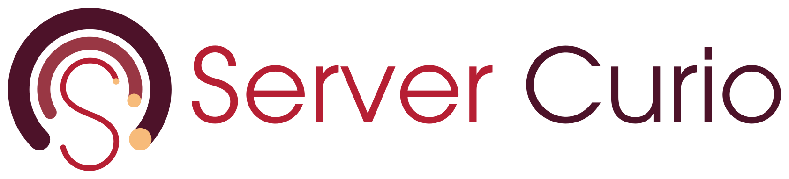

  

## Project templates

| Repository | Description |
| --- | --- |
| [go-echo-starter](https://github.com/servercurio/go-echo-starter) | Starter template for GoLang based web servers using the Labstack Echo framework. |
| [go-cli-starter](https://github.com/servercurio/go-cli-starter) | Starter template for GoLang based CLI tools. |
| [go-library-starter](https://github.com/servercurio/go-library-starter) | Starter template for GoLang based libraries. |

## Documentation

| Repository | Description |
| --- | --- |
| [rackmarshal](https://github.com/servercurio/rackmarshal) | Project documentation, design, and website for the Server Curio project family. |
